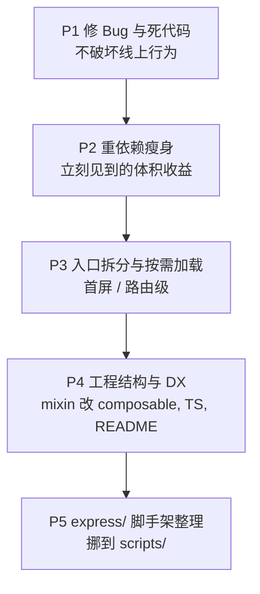

# VitePress 博客优化方案

## 现状摘要

- 入口 [docs/.vitepress/theme/index.ts](docs/.vitepress/theme/index.ts) 一次性 import 了 three.js / videojs / 全量 element-plus / 所有 view 组件，所有 markdown 页都吃这套包。
- [docs/.vitepress/utils/mixins/directives/directives.js](docs/.vitepress/utils/mixins/directives/directives.js) 用 Vue 2 钩子，在 Vue 3 里不会触发。
- [docs/.vitepress/theme/components/common/InputLockPassword.vue](docs/.vitepress/theme/components/common/InputLockPassword.vue) `<script>` 里没有 export 任何东西。
- [docs/.vitepress/theme/components/views/travel/travelCalendar.vue](docs/.vitepress/theme/components/views/travel/travelCalendar.vue) 含 1000+ 行内联数据，并在每个 item 渲染时 `console.error(item)`。
- [express/plan/planMethods.js](express/plan/planMethods.js) 路径写成 `.vuepress`（实际是 `.vitepress`），且用 `require()` 读 JSON 会被缓存。
- [express/index.js](express/index.js) `res.send(200)` 是发 body=200，不是 200 状态码；`/forward/page` 异常分支会 `res.json` 两次。
- 同时存在 `yarn.lock` + `pnpm-lock.yaml`；`moment` / `shiki` / `core-js@2` 三个重型/EOL 依赖只在极个别地方用到。
- `app.mixin()` 注入指令在 Vue 3 里不会全局注册指令，且 mixin 模式应改为 composable。

## 优先级路线图

## P1 修 Bug 与死代码

聚焦在用户已能感知但被掩盖的问题，零风险改动。

- 把 `directives.js` 中的 `bind / inserted / unbind` 改为 Vue 3 的 `mounted / beforeMount / unmounted`，并改为通过 `app.directive(name, def)` 在 `enhanceApp` 注册（不再走 mixin）。
- 修复 / 删除 `InputLockPassword.vue`：把 `<script>` 改成 `<script setup>`，正确实现解锁逻辑；如果已经被 `Lock.vue` 替代，整个组件删除。
- 删掉 [travelCalendar.vue](docs/.vitepress/theme/components/views/travel/travelCalendar.vue#L995) 的 `console.error(item)`；顺手把 `computedColor` 改成 `const computedColor = (item) => ...`（已经是函数，名字易误解，可改名 `getColor`）。
- 修 [planMethods.js](express/plan/planMethods.js)：路径改为 `.vitepress`，并改 `fs.readFileSync` + `JSON.parse` 替代 `require()`，避免缓存。
- 修 [express/index.js](express/index.js)：`res.send(200)` → `res.sendStatus(200)`；改为使用 `cors` 中间件而不是手写 header；`/forward/page` 异常处理用 `if (!res.headersSent) res.json(...)` 或者抽出统一的错误处理。
- 修 [utils_createFile.js](express/utils/utils_createFile.js)：把"先写空文件再 async 写真实内容"改成 `fs.mkdirSync(path.dirname(filePath), { recursive: true })` + `fs.writeFileSync`；干掉 `dirCache`。
- 删除 `yarn.lock` 或 `pnpm-lock.yaml` 之一（结合 `.npmrc` 看仓库是 pnpm 还是 yarn，删多余的）。

## P2 重依赖瘦身

只动 import，不动业务行为。

- `moment` → `dayjs`（在 [tag.vue](docs/.vitepress/theme/components/views/tag/tag.vue)、[friend.vue](docs/.vitepress/theme/components/views/friend/friend.vue) 的 `format('YYYY-MM-DD HH:mm:ss')` 直接 1:1 替换），从 `package.json` 卸载 `moment`。
- 卸载 `shiki`，把 [CodeDemo.vue](docs/.vitepress/theme/components/common/CodeDemo.vue) 改为：在 markdown 里用三个反引号代码块（VitePress 自带 shiki 高亮），组件只做"折叠/显示代码"的容器。
- 卸载 `core-js`，把 [bigFileUploadAndResume.js](express/other/bigFileUploadAndResume/bigFileUploadAndResume.js) 里的 `core-js/core/dict` 改为 `Object.create(null)` 或 `Map`。
- 评估是否真的需要 `@vicons/carbon`、`@vicons/ionicons5`、`@vicons/material`、`@vicons/tabler` 四个包共存：跑一遍 `rg "@vicons/" docs --files-with-matches | xargs -I{} rg -o "from '@vicons/.*'" {}`，把不用的删掉。
- `@videojs-player/vue` + `video.js` 只在 `DialogVideo.vue` 用到，已经是 `await import()` 动态加载，OK。

## P3 入口拆分与按需加载

让首页/博客文章页不再下载所有 view 组件。

- 改写 [docs/.vitepress/theme/index.ts](docs/.vitepress/theme/index.ts)：
  - 全部 `import xxx from '@theme/components/views/xxx'` 改为 `defineAsyncComponent(() => import('...'))`。
  - 把 `import 'element-plus/dist/index.css'` 与 `app.use(ElementPlus)` 拆掉，改用 `unplugin-vue-components` 的 `ElementPlusResolver` 自动按需引入；`zhCn` locale 和 `<el-config-provider>` 留在 [Layout.vue](docs/.vitepress/theme/components/layout/Layout.vue)。
  - `Mixins` 拆分：`directives` → `enhanceApp` 里 `app.directive`；`dateMethods` → 改为 `composables/useDate.ts`，按需 import。
- 在 [config.ts](docs/.vitepress/config.ts) 的 `vite.plugins` 加上 `Components({ resolvers: [ElementPlusResolver()] })`、`AutoImport({ resolvers: [ElementPlusResolver()] })`。
- 把 `travelCalendar.vue` 1000+ 行内联数据拆成 `docs/public/json/travel.json` 或 `docs/.vitepress/utils/loaders/travel.data.js`，组件只做渲染。
- 把 [index.vue](docs/.vitepress/theme/components/views/index/index.vue) 的 `setInterval` 重置 EasyTyper 改为：先 `easyTyper.close?.()` 或留住引用 `clear`，避免实例累积。
- 修 [MusicPlayer.vue](docs/.vitepress/theme/components/views/index/components/MusicPlayer.vue) 的 `draw`：在 paused 时 `cancelAnimationFrame`，恢复播放再起。

## P4 工程结构 / DX

- 把 [config.ts](docs/.vitepress/config.ts) 的 `require('./plugins/extends-markdown/markdown-it-code-default')` 改成 ESM 顶部 import；把插件文件本身改成 `export default function ...`。
- 增补 `tsconfig.json` 的 `paths`：补上 `"@theme/*": ["docs/.vitepress/theme/*"]` 和 `"@/*": ["./*"]`，与 vite alias 对齐；`include` 加上 `docs/.vitepress/**/*.js` 让编辑器能解析。
- 决定 `noImplicitAny` 取舍：要么打开（推荐），要么去掉 `strict: true` 避免冲突。
- 删除 [docs/.vitepress/theme/components/layout/VPNavBar.vue](docs/.vitepress/theme/components/layout/VPNavBar.vue)（没在 alias 里挂上，目前是死代码）；或在 [config.ts](docs/.vitepress/config.ts) 的 alias 里补上对应正则。
- 合并两个 public 目录：把 `docs/.vitepress/public/` 的内容挪到 `docs/public/`，因为 VitePress 只服务后者。
- 重写 `README.md`：项目简介、`pnpm dev` / `pnpm build` / `pnpm serves`、目录结构、部署到 GitHub Pages 的方法。
- `package.json`：把 `"build"` 与 `"docs:build"` 合并；`scripts` 里加 `"typecheck": "vue-tsc --noEmit"`。

## P5 express/ 脚手架整理

`express/` 实际是"创建文章 / 抓取掘金 / 大文件上传 demo"的本地脚手架，不是博客运行时。建议：

- 重命名 / 移动到 `scripts/`，并在 `package.json` 里把 `serves` 改成 `scripts:serve`；明确告诉读者这是 dev 工具不是产品。
- `bigFileUploadAndResume/` 是练习项目，挪到独立子目录或干脆删除，避免跟博客主线混在一起。
- `Crawler` + `jsdom` 这条转发掘金的链路如果不再用，整个 `/forward/page` 删掉；保留则把错误响应改一致（见 P1）。
- 给 `createPageMethods.js` 的 `try { createMd() } catch { res.json(...) }` 改成 `await createMd()`，否则异步错误抓不到。

## 不做的事

- 不重写 VitePress 的内部组件（`VPDoc.vue` / `VPDocAside` 等）行为，仅保留现有的覆盖。
- 不动博客 markdown 内容本身。
- 不改 valine 评论系统的实现选型。
