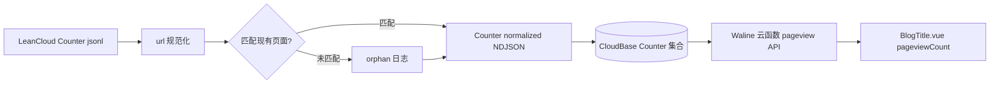

# 阅读量迁移计划：LeanCloud Counter → Waline + CloudBase（不要评论模块）

## 方案选择与理由

需求：仅在每篇文章顶部展示该文章 PV、保留 199 条历史计数、最好免费、国内访客为主。

候选对比（按贴合度排序）：

- 推荐：Waline（仅启用 pageview）+ 腾讯云 CloudBase
  - 国内访问最稳；CloudBase 免费基础额度对个人博客足够；可一次性导入 199 条历史；前端代码改动最小（沿用 `@waline/client` 的 `pageviewCount`）。
  - 取舍：严格说 CloudBase 是按量计费，超出免费额度会有几角钱级别小费用，可在控制台设月度预算预警。
- 备选 A：不蒜子（busuanzi）
  - 几行 JS 接入，永久零成本，专为博客设计。代价：无法导入 199 条历史，所有文章计数从 0 重新开始；服务偶有抽风。
- 备选 B：Cloudflare Workers + KV 自建计数 API
  - 永久免费层够用、按 path 计数干净。代价：CF Workers 在国内直连不稳定，需要把 `sanghangning.com` 的 NS 转到 Cloudflare 才能套自定义路由，对你目前阿里云 CDN 的架构改动较大。

下面按推荐方案展开，最后给出备选 A 的极简对照执行清单。

## 数据现状（基于导出包盘点）

- `Counter.0.jsonl` 199 条；字段：`url / xid / time / title / createdAt / updatedAt / objectId / ACL`。
- `url` 一级前缀分布混乱：`/blog/...` 135、`/views/...` 47、`/say-my-life/...` 12、`/notes/...` 1、空 4；需要规范化。
- 评论数据 `Comment.0.jsonl`（205 条）本次不导入，但导出包先归档保存以备反悔。

## 目标 path 规范

与现有前端 `valineId` 生成规则保持一致（见 [docs/.vitepress/theme/components/common/Valine.vue](docs/.vitepress/theme/components/common/Valine.vue) L22-30 与 [docs/.vitepress/theme/components/layout/BlogTitle.vue](docs/.vitepress/theme/components/layout/BlogTitle.vue) L130-138）：形如 `/blog/xxx.html`、`/life/xxx.html`，frontmatter 自定义 `config.valineId` 优先。

规则（顺序套用）：

1. 去掉 `/say-my-life` 前缀（旧 base path 残留）。
2. 去掉 `/views` 前缀。
3. 缺失开头 `/` 时补上。
4. 与 `docs/views` 实际页面集合 + frontmatter 自定义 `config.valineId` 比对，未命中的写入 `migration-orphan.log`，但仍按规则规范化后保留入库（不丢弃）。



## 阶段拆解

### 1. CloudBase 准备

- 开通腾讯云 CloudBase 按量计费环境，记录 `ENV_ID`。
- 启用：云函数、云数据库、HTTP 访问服务；设月度费用预警。

### 2. Waline 服务端部署到 CloudBase（仅 pageview）

- 按 Waline 官方文档 `https://waline.js.org/cloudbase/` 一键部署。
- 关键环境变量：
  - `JWT_TOKEN`：随机长字符串。
  - `SITE_URL` = `https://www.sanghangning.com`。
  - `SITE_NAME` = 野宁新之助。
  - `SECURE_DOMAINS` = `sanghangning.com,www.sanghangning.com`。
- 评论功能不在前端挂载即可，无需特别关闭；admin 后台仅作管理入口（建议设强密码，不公开）。

### 3. 数据规范化脚本（新增 - 精简版）

新增 `scripts/migrate-leancloud-counter.mjs`：

- 输入：解压后的 `migrate/in/Counter.0.jsonl`（仓库根的 .tar.gz 解压；目录加入 `.gitignore`）。
- 处理：
  - 跳过 `#filetype` 头行。
  - 对每条 `{url, xid, time, ...}` 套用 4 条规范化规则，同步写回 `url` 与 `xid`。
  - 用 `globby('docs/views/**/*.md')` + 解析 frontmatter `config.valineId` 构建白名单做匹配，未命中写入 `migrate/out/migration-orphan.log`。
  - 输出 Waline 期望结构的 NDJSON：`migrate/out/Counter.normalized.ndjson`，字段保留 `url / time / createdAt / updatedAt`，丢弃 `ACL / objectId / xid`（CloudBase 会重新生成 `_id`）。
- 在 [package.json](package.json) `scripts` 加入 `"migrate:counter": "node scripts/migrate-leancloud-counter.mjs"`。

### 4. 数据导入 CloudBase

- CloudBase 控制台 → 云数据库 → 创建 `Counter` 集合（与 Waline 默认表名一致）。
- 上传 `Counter.normalized.ndjson`，或使用 `cloudbase database:import -e <ENV_ID> --collection Counter --file ...`。
- 抽查若干条记录的 `url` 与 `time`。

### 5. 前端改造（拆评论、保阅读量）

- [package.json](package.json)：移除 `valine-gnas`，新增 `@waline/client`（v3）。
- [docs/.vitepress/config.ts](docs/.vitepress/config.ts) L46-50：把 `themeConfig.valine` 替换为：

```ts
waline: {
  enable: true,
  serverURL: 'https://<env-id>-<region>.service.tcloudbase.com/waline',
}
```

  删除 `appId` / `appKey`。

- [docs/.vitepress/theme/components/layout/BlogTitle.vue](docs/.vitepress/theme/components/layout/BlogTitle.vue) L55-105：
  - 删除整段 `<span class="leancloud_comments">...</span>`（评论数）。
  - 保留 `<span class="leancloud_visitors">`，把内部 `<i class="leancloud-visitors-count">` 改为 `<i class="waline-pageview-count" :data-path="valineId">`。
  - 显示条件 `themeConfig.valine.enable` 与 `config.valine` 沿用 frontmatter 字段，避免改全部 markdown，仅在 `<script setup>` 里把 `themeConfig.value.valine` 改读 `themeConfig.value.waline`。
  - 在 `onMounted` 中：

```ts
import { pageviewCount } from '@waline/client/pageview'
pageviewCount({ serverURL: themeConfig.value.waline.serverURL, path: valineId.value })
```

- [docs/.vitepress/theme/components/common/Valine.vue](docs/.vitepress/theme/components/common/Valine.vue)：整个组件下线（不再被引用）。检查并清理引用点（重点：文章正文末尾挂载评论的位置 + 任何 `<Valine />` 使用）。
- [docs/.vitepress/theme/components/common/ValineGlobal.vue](docs/.vitepress/theme/components/common/ValineGlobal.vue)：本次不需要全站访问量，组件下线（用户已确认仅需单页 PV）。
- 文章 frontmatter 的 `config.valine`、`config.valineId` 字段语义保留（前端只读，不改 markdown）。

### 6. /Friend.html 留言板处理

49 条历史评论原本挂在留言板，本次评论模块下线后，需要确认：

- 方案 a：直接下线 `Friend.md`（或改为静态联系方式页）。
- 方案 b：保留页面，文末加一行「留言已迁出，如需联系请加 QQ」。
- 默认走方案 b；执行阶段会再确认。

### 7. 上线验证

- 本地 `npm run dev`：
  - 老文章如 `/blog/vue/VuepressIntractableDisease.html` 阅读量是否恢复（应 ≥ 历史值）。
  - 新文章首次访问从 1 开始累加。
  - 多次刷新同一页面，确认 Waline 默认每次都 +1（与 Valine 行为一致）。
- 抽查 `migration-orphan.log` 中的孤立记录是否需要补录或忽略。

### 8. 清理

- 删除 `valine-gnas` 依赖；清理 less 中残余 `leancloud_*` 选择器的死代码。
- 把导出 `.tar.gz` 与 `migrate/in`、`migrate/out` 移到本地归档目录，从仓库删除（`.gitignore` 已覆盖）。
- 在 LeanCloud 停服前任意时间关闭应用。

---

## 备选 A：不蒜子极简方案（若放弃历史 199 条）

如果可以接受所有文章计数从 0 重新开始，则上面 1/2/3/4/6 步全部省略，只剩前端改造：

- [package.json](package.json)：移除 `valine-gnas`，无需新依赖。
- [docs/.vitepress/theme/index.ts] 或 layout 入口：动态注入 `https://busuanzi.ibruce.info/busuanzi/2.3/busuanzi.pure.mini.js`。
- [docs/.vitepress/theme/components/layout/BlogTitle.vue](docs/.vitepress/theme/components/layout/BlogTitle.vue)：
  - 删除评论数 span。
  - 把阅读量改为 `<span id="busuanzi_container_page_pv"><i id="busuanzi_value_page_pv"></i></span>`。
- 删除 `Valine.vue` / `ValineGlobal.vue` 引用、移除 `themeConfig.valine` 配置。

代价：199 条历史阅读量丢失；不蒜子无 SLA、偶尔失效。
